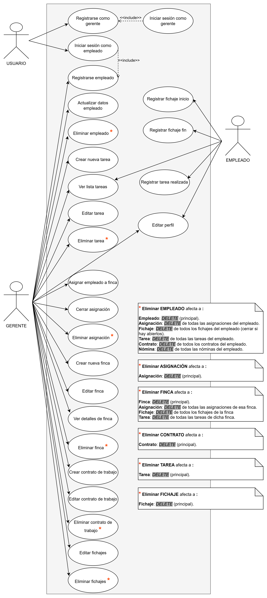
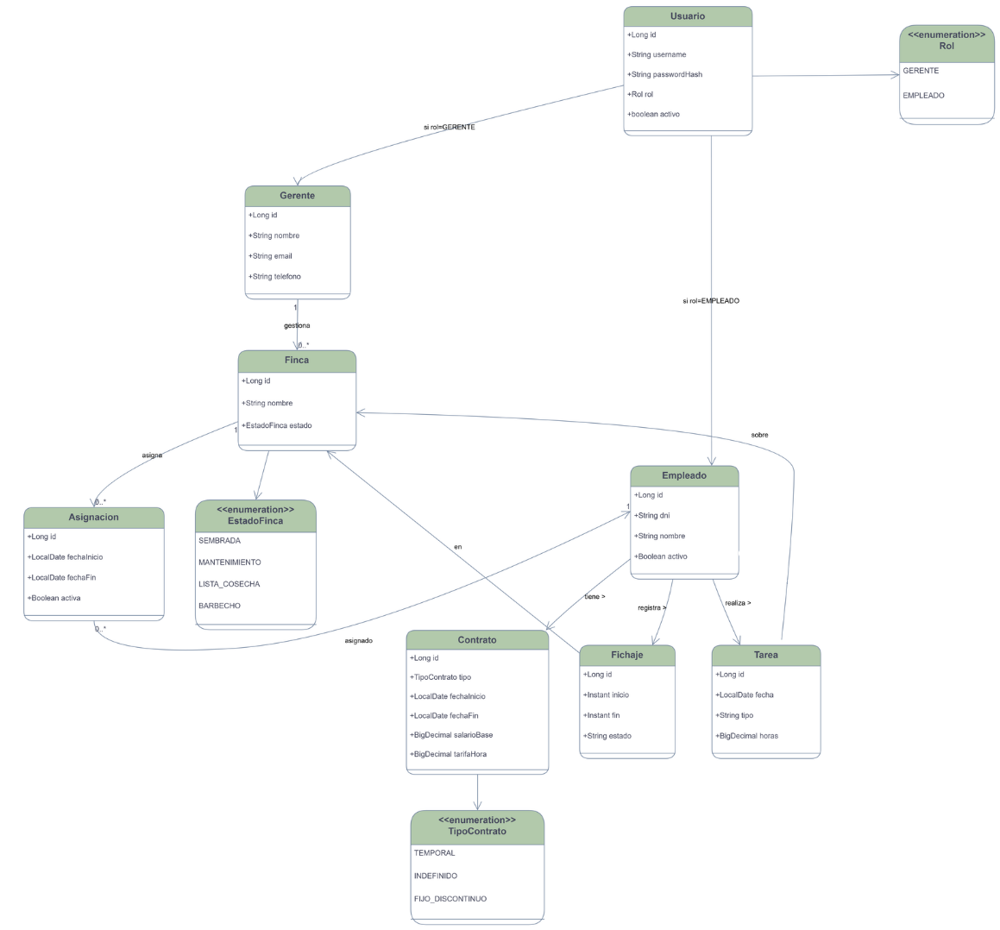

## PROYECTO MyDAI: AgroManager

---

## Índice

1. Requisitos
2. Implementación BD
3. Casos de Uso
4. Modelo de datos

---

# 1. Requisitos

## 🌱 AgroManager


## 👥 Integrantes

| Nombre                             | DNI       | Foto                                   |
|------------------------------------|-----------|----------------------------------------|
| **Diego Durán Barroso**            | 20969286W |  |
| **Hugo Sánchez de la Roda Rivera** | 50489290N |   |

## 📝 Eslogan

> **“Sembramos organización, cosechamos resultados.”**

## 📖 Resumen

La aplicación web **AgroManager** debe permitir a los responsables de fincas gestionar trabajadores, controlar su
jornada laboral, generar contratos y conocer en tiempo real la ubicación de los empleados y el estado de las fincas.

## 📌 Descripción

AgroManager es una aplicación web que busca simplificar la gestión agrícola centralizando en un solo sistema las
principales tareas de organización de trabajadores y fincas. El sistema permite dar de **alta y baja empleados**,
asignar contratos y relacionarlos con las fincas. Además, incorpora un **módulo de control de jornada** con fichajes,
horas trabajadas y tareas realizadas. El cálculo de **nóminas automáticas** se genera según salario base, horas
trabajadas
y pluses correspondientes. La aplicación integra **geolocalización en tiempo real** para conocer dónde está cada
trabajador y ofrece la posibilidad
de **actualizar el estado de las fincas** desde el terreno.

## ✅ Funcionalidades, Requisitos, “Pliego de condiciones”

- 📋 El responsable debe poder **gestionar los trabajadores** (altas, bajas, contratos, asignaciones a fincas).
- ⏱️ Los empleados deben poder **fichar su jornada laboral**, indicando inicio y fin de la misma.
- 🕒 El sistema debe **registrar horas trabajadas y tareas realizadas** durante la jornada.
- 💰 El sistema debe permitir **generar nóminas automáticas**, teniendo en cuenta salario base, horas trabajadas y
  pluses.
- 🌾 Los trabajadores podrán **cambiar el estado de la finca** en la que trabajan (ejemplo: sembrada, en mantenimiento,
  lista para cosecha, etc.).
- 📱 La aplicación debe ser **responsive**, funcionando en dispositivos móviles y PC.
- 📊 Los responsables podrán **visualizar resúmenes** en paneles de control con la situación actual de trabajadores,
  nóminas y fincas.

## 🌟 Funcionalidades opcionales, recomendables o futuribles

- 📑 Mostrar al responsable **informes automáticos** con horas trabajadas por finca, productividad de trabajadores y
  estados de las fincas.
- 📂 Posibilidad de **exportar datos** en formatos estándar (Excel, PDF).
- 🔗 Integración con **sistemas externos de facturación o RRHH**.
- 🌍 Posibilidad de elegir el **idioma de la interfaz**.
- 🔔 Inclusión de **notificaciones automáticas** (ejemplo: fin de contrato, incidencias en fichajes, cambios de estado de
  finca).

---

# 2. Implementación BD 🧩

La base de datos de **AgroManager** se implementa mediante **Docker** para asegurar un entorno reproducible, aislado y
fácil de desplegar.
El contenedor principal utiliza **MySQL** como sistema gestor de base de datos y se comunica con la aplicación **Spring
Boot** a través de la red interna definida en el archivo `docker-compose.yml`.

### ⚙️ Pasos de despliegue

1. Abrir una terminal en la raíz del proyecto.
2. Ejecutar el siguiente comando para levantar los contenedores:

   ```bash
   docker compose up -d
   ```

3. Una vez iniciados los servicios, acceder al contenedor de MySQL:

   ```bash
   docker exec -it agromanager-mysql mysql -u root -p
   ```
   Contraseña: `root`

4. Conectarse a la base de datos y verificar las tablas generadas automáticamente por **JPA/Hibernate**:

   ```sql
   USE agromanager;
   SHOW TABLES;
   SELECT * FROM empleado;
   SELECT * FROM finca;
   ```

---

# 3. Casos de Uso 🧠

A continuación, se explican los **casos de uso** reflejados en el diagrama del sistema, diferenciando las acciones
disponibles para **Usuario**, **Gerente** y **Empleado**.



# Casos de Uso – AgroManager (según el diagrama)

| **Nº** | **Actor**            | **Caso de uso**                 | **Descripción**                                                                                           |
|--------|----------------------|---------------------------------|-----------------------------------------------------------------------------------------------------------|
| **1**  | **Usuario**          | **Registrarse como gerente**    | Crea un nuevo usuario con rol GERENTE para acceder por primera vez (incluye iniciar sesión como gerente). |
| **2**  | **Usuario**          | **Iniciar sesión como gerente** | Permite a un gerente autenticarse en el sistema mediante credenciales.                                    |
| **3**  | **Usuario**          | **Iniciar sesión como empleado** | Permite a un empleado entrar en el sistema usando su ID y contraseña.                                     |
| **4**  | **Gerente/Empleado** | **Editar perfil**               | El usuario puede editar sus datos perdonales y foto.                                                      |
| **5**  | **Gerente**          | **Registrar empleado**          | Crea un nuevo usuario con rol EMPLEADO asociado a un empleado existente o recién creado.                  |
| **6**  | **Gerente**          | **Actualizar datos empleado**   | Modifica datos del empleado como nombre, DNI, estado o usuario asociado.                                  |
| **7**  | **Gerente**          | **Eliminar empleado**           | Elimina al empleado y borra en cascada asignaciones, fichajes, tareas, contratos y nóminas asociadas.     |
| **8**  | **Gerente**          | **Editar tarea**                | Modifica los datos de una tarea existente.                                                                |
| **9**  | **Gerente**          | **Crear nueva tarea**           | Permite crear una tarea para ser asignada o realizada por un empleado.                                    |
| **10** | **Gerente/Empleado** | **Ver lista tareas**            | Consulta el listado de todas las tareas creadas.                                                          |
| **11** | **Gerente**          | **Eliminar tarea**              | Elimina una tarea del sistema.                                                                            |
| **12** | **Gerente**          | **Asignar empleado a finca**    | Registra una asignación entre un empleado y una finca.                                                    |
| **13** | **Gerente**          | **Cerrar asignación**           | Finaliza una asignación sin eliminarla, anotando fecha de cierre.                                         |
| **14** | **Gerente**          | **Eliminar asignación**         | Borra la asignación entre empleado y finca.                                                               |
| **15** | **Gerente**          | **Crear nueva finca**           | Crea una finca indicando nombre, ubicación, estado y superficie.                                          |
| **16** | **Gerente**          | **Editar finca**                | Modifica los datos de una finca (nombre, ubicación, superficie o estado).                                 |
| **17** | **Gerente**          | **Ver detalle de finca**        | Observar detllas de la finca seleccionada + API de un mapa integrado.                                     |
| **18** | **Gerente**          | **Eliminar finca**              | Elimina una finca y borra asignaciones y tareas dependientes.                                             |
| **19** | **Gerente**          | **Crear contrato de trabajo**   | Registra un contrato con tipo, fechas, salario y tarifa por hora.                                         |
| **20** | **Gerente**          | **Editar contrato de trabajo**  | Modifica los datos de un contrato existente.                                                              |
| **21** | **Gerente**          | **Eliminar contrato de trabajo** | Elimina un contrato concreto del sistema.                                                                 |
| **22** | **Gerente**          | **Editar fichajes**             | Modifica fichajes de los empleados (horas de inicio/fin).                                                 |
| **23** | **Gerente**          | **Eliminar fichajes**           | Elimina un fichaje concreto del sistema.                                                                  |
| **24** | **Empleado**         | **Registrar fichaje inicio**    | Registra la hora de inicio de la jornada laboral.                                                         |
| **25** | **Empleado**         | **Registrar fichaje fin**       | Registra la hora de fin de la jornada laboral y cierra el fichaje.                                        |
| **26** | **Empleado**         | **Registrar tarea realizada**   | El empleado registra una tarea completada indicando tipo y duración.                                      |


# 4. Modelo de datos 🧭

El siguiente diagrama muestra el **modelo de datos principal** de AgroManager, donde se representan las entidades,
relaciones y enumeraciones que conforman la base de datos.




## 5.1. Tabla `usuario`

Tabla base para las credenciales de acceso y datos de cuenta.

| Campo         | Tipo (lógico) | Descripción                                   |
|---------------|---------------|-----------------------------------------------|
| `id` (PK)     | BIGINT        | Identificador único del usuario.             |
| `email`       | VARCHAR       | Correo electrónico (único).                  |
| `password`    | VARCHAR       | Contraseña cifrada.                          |
| `rol`         | ENUM Rol      | Rol de la aplicación (`GERENTE`, `EMPLEADO`).|
| `foto_perfil` | VARCHAR       | Nombre del fichero de imagen de perfil.      |
| `activo`      | BOOLEAN       | Indica si la cuenta está activa.             |

**Relaciones principales**

- 1:1 con **Gerente** (un usuario puede ser gerente).
- 1:1 con **Empleado** (un usuario puede ser empleado).

---

## 5.2. Tabla `gerente`

Datos específicos del gerente.

| Campo        | Tipo   | Descripción                           |
|--------------|--------|---------------------------------------|
| `id` (PK)    | BIGINT | Identificador del gerente.            |
| `nombre`     | VARCHAR| Nombre y apellidos.                   |
| `dni`        | VARCHAR| Documento identificativo.             |
| `telefono`   | VARCHAR| Teléfono de contacto.                 |
| `usuario_id` | BIGINT (FK) | Referencia a `usuario.id`.     |

**Relaciones**

- 1:N con **Finca** (un gerente gestiona muchas fincas).
- 1:N con **Empleado** (un gerente puede gestionar múltiples empleados, según diseño lógico del proyecto).

---

## 5.3. Tabla `empleado`

Representa a los trabajadores de la empresa.

| Campo        | Tipo   | Descripción                                       |
|--------------|--------|---------------------------------------------------|
| `id` (PK)    | BIGINT | Identificador del empleado.                       |
| `dni`        | VARCHAR| DNI del empleado (único).                         |
| `nombre`     | VARCHAR| Nombre y apellidos.                               |
| `telefono`   | VARCHAR| Teléfono de contacto.                             |
| `activo`     | BOOLEAN| Indica si el empleado sigue en plantilla.         |
| `usuario_id` | BIGINT (FK) | Referencia a `usuario.id` (si puede iniciar sesión). |

**Relaciones**

- 1:N con **Asignacion** (un empleado puede trabajar en varias fincas a lo largo del tiempo).
- 1:N con **Contrato**.
- 1:N con **Fichaje**.
- 1:N con **Tarea**.

---

## 5.4. Tabla `finca`

Información de cada finca agrícola.

| Campo        | Tipo              | Descripción                                      |
|--------------|-------------------|--------------------------------------------------|
| `id` (PK)    | BIGINT            | Identificador de la finca.                       |
| `nombre`     | VARCHAR           | Nombre de la finca.                              |
| `ciudad`     | VARCHAR           | Ciudad donde se ubica.                           |
| `provincia`  | VARCHAR           | Provincia.                                       |
| `area`       | DECIMAL           | Superficie en hectáreas.                         |
| `estado`     | ENUM EstadoFinca  | Estado actual (`SEMBRADA`, `MANTENIMIENTO`, `LISTA_COSECHA`, `BARBECHO`). |
| `latitud`    | DECIMAL           | Coordenada de latitud.                           |
| `longitud`   | DECIMAL           | Coordenada de longitud.                          |
| `gerente_id` | BIGINT (FK)       | Gerente responsable (`gerente.id`).              |

**Relaciones**

- 1:N con **Asignacion** (empleados asignados a una finca).
- 1:N con **Tarea** (tareas realizadas en esta finca).

---

## 5.5. Tabla `asignacion`

Une **empleados** y **fincas** durante un intervalo de tiempo.

| Campo          | Tipo   | Descripción                                      |
|----------------|--------|--------------------------------------------------|
| `id` (PK)      | BIGINT | Identificador de la asignación.                  |
| `empleado_id`  | BIGINT (FK) | Referencia a `empleado.id`.               |
| `finca_id`     | BIGINT (FK) | Referencia a `finca.id`.                  |
| `fecha_inicio` | DATE   | Fecha de inicio de la asignación.               |
| `fecha_fin`    | DATE   | Fecha de fin (puede ser nula si sigue activa).  |
| `activa`       | BOOLEAN| Marca si la asignación está vigente.            |

---

## 5.6. Tabla `contrato`

Contratos laborales de cada empleado.

| Campo          | Tipo               | Descripción                                             |
|----------------|--------------------|---------------------------------------------------------|
| `id` (PK)      | BIGINT             | Identificador del contrato.                             |
| `empleado_id`  | BIGINT (FK)        | Referencia a `empleado.id`.                             |
| `tipo`         | ENUM TipoContrato  | Tipo (`TEMPORAL`, `INDEFINIDO`, `FIJO_DISCONTINUO`).    |
| `fecha_inicio` | DATE               | Inicio de vigencia.                                     |
| `fecha_fin`    | DATE               | Fin de vigencia (puede ser nula).                       |
| `salario_base` | DECIMAL            | Salario base mensual.                                   |
| `tarifa_hora`  | DECIMAL            | Importe por hora trabajada.                             |

---

## 5.7. Tabla `fichaje`

Registra el control horario de los empleados.

| Campo            | Tipo     | Descripción                                          |
|------------------|----------|------------------------------------------------------|
| `id` (PK)        | BIGINT   | Identificador del fichaje.                           |
| `empleado_id`    | BIGINT (FK) | Referencia a `empleado.id`.                    |
| `fecha_hora_ini` | DATETIME | Fecha y hora de inicio de la jornada.               |
| `fecha_hora_fin` | DATETIME | Fecha y hora de fin (cuando se cierra el fichaje).  |
| `duracion_horas` | DECIMAL  | Horas totales calculadas (campo de apoyo).          |

---

## 5.8. Tabla `tarea`

Tareas realizadas por los empleados.

| Campo        | Tipo   | Descripción                                   |
|--------------|--------|-----------------------------------------------|
| `id` (PK)    | BIGINT | Identificador de la tarea.                    |
| `empleado_id`| BIGINT (FK) | Empleado que realiza la tarea.         |
| `finca_id`   | BIGINT (FK) | Finca donde se realiza.                 |
| `descripcion`| VARCHAR| Descripción detallada de la actividad.        |
| `fecha`      | DATE   | Día en que se realiza la tarea.               |
| `horas`      | DECIMAL| Tiempo invertido en la tarea.                 |

---


## 5.10. Enumeraciones

- **`Rol`**
    - `GERENTE`
    - `EMPLEADO`

- **`EstadoFinca`**
    - `SEMBRADA`
    - `MANTENIMIENTO`
    - `LISTA_COSECHA`
    - `BARBECHO`

- **`TipoContrato`**
    - `TEMPORAL`
    - `INDEFINIDO`
    - `FIJO_DISCONTINUO`

Este modelo de datos es el que se ha implementado en **MySQL** mediante entidades JPA en el proyecto **AgroManager**, y es coherente con los casos de uso y el diagrama de clases incluidos en el documento.